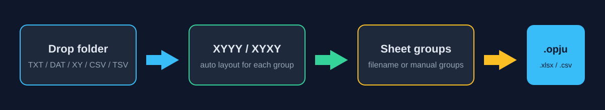

# Spectra to Origin

**把一批两列 XRD／光谱数据整理成 Origin 工程：每组一张工作表、一张曲线图。也可以只导出 Excel 和 CSV。**



适合温度、时效时间或样品系列的重复导入工作。自动设置 X/Y 列类型、列名和单位，保留各条谱线的数据点。工具不做插值、拟合、平滑、基线扣除或强度归一化。

## 开始使用

Windows 用户可以从 [Releases](https://github.com/D-sudoasd/spectra-to-origin/releases) 下载已发布的可执行文件。仓库中的新功能需要运行当前源码或重新构建；旧版 Release 不会随源码提交更新。

从源码运行（Python 3.10+）：

```powershell
py -3 -m pip install -r requirements.txt
.\run.bat
```

导出 `.opju` 还需要本机安装并激活 Origin Pro，以及当前 Python 环境中的绑定：

```powershell
py -3 -m pip install originpro
```

**只导出 Excel／CSV 不需要 Origin。** 为保护已经打开的工程，生成 `.opju` 前需要先保存并关闭现有 Origin 窗口；工具检测到 Origin 正在运行时会停止导出。

## 窗口操作

1. 拖入文件或文件夹，或点 **添加文件／添加文件夹**。文件夹会递归扫描，文件名按自然顺序排列，例如 `sample2` 在 `sample10` 前。
2. 选中谱线查看曲线预览、点数、数值范围和完整路径。预览只帮助检查输入，不改变导出数据。
3. 使用文件名分组、指定组数均分，或者全部放入一张表。可以移动谱线、调整顺序和修改组名。
4. 选择自动布局，按数据类型填写 X/Y 轴名称和单位。例如 XRD 使用 `2theta / deg`，拉曼谱可以使用 `Raman shift / cm^-1`。
5. 点 **生成 Origin 工程**，或 **只导出 Excel/CSV**。导出在独立进程完成，窗口显示进度并防止重复启动。

## 输入格式

| 项目 | 支持情况 |
| --- | --- |
| 扩展名 | `.txt`、`.dat`、`.xy`、`.csv`、`.tsv` |
| 列数 | 恰好两列数值，至少两个数据点 |
| 分隔符 | 空格、Tab、逗号或分号 |
| 表头 | 可选的一行两列列名；`#` 开头的注释行 |
| 编码 | UTF-8、GBK，以及有 BOM 的 UTF-16 |
| 数值 | 普通小数、科学计数法，包含 Fortran `D` 指数 |
| 非法数据 | 拒绝 NaN、Inf、缺列、多列和损坏数据，报告文件及行号 |

小数点使用 `.`；逗号用作列分隔符。`D` 指数读入后规范为 `E`，不经过浮点数转回文本。输入文件不会被改写。Excel 和 Origin 数值列使用其浮点数表示，CSV 保留读入的数值文本。

同一路径重复添加只保留一次；不同文件夹的同名文件会分别保留。对于历史数据中的 `按温度` 副本目录，仅同名且内容相同的相关副本去重，内容不同的文件保留。

仓库 [examples](examples) 中提供了小型演示数据，可直接添加整个文件夹。

## 布局与导出

**自动布局按每个组独立判断。** 同组 X 数值完全相等时使用 XYYY（一个 X，多列 Y）；否则使用 XYXY（每条曲线各有 X/Y）。`1` 和 `1.0` 视为相等，不使用近似容差合并不同网格。不同组可以使用不同布局。

强制 XYYY 时，每组必须有相同 X 网格，否则在写文件和启动 Origin 之前报错。XYXY 支持不同点数，用空白单元格补齐表格；不会添加测量点。

| 输出 | 内容 |
| --- | --- |
| `.opju` | 每组一张工作表和一张线图；保留列名、单位和备注 |
| `.xlsx` | 全部分组工作表，以及记录源路径等信息的 `readme` 表 |
| 单组 CSV | 与 Excel 同名的 `.csv`，前三行为列名、单位、备注 |
| 多组 CSV | `<输出名>_csv/` 文件夹，每组一个 CSV，覆盖全部谱线 |

组名转换为有效且唯一的工作表名／文件名。目标与输入文件冲突会在写出前被拒绝。导出采用临时文件和替换，保存失败不会把旧文件误报为本次成功；多种输出的失败仍会明确报错。

## 命令行

先检查数据，不启动 Origin、不生成文件：

```powershell
py -3 spectra_to_origin.py --check -i examples --group-by-name
```

生成 Origin 工程：

```powershell
py -3 spectra_to_origin.py --cli -i "D:\data\spectra" -o "D:\out\series.opju" --layout auto --group-by-name
```

仅生成表格：

```powershell
py -3 spectra_to_origin.py --cli --xlsx-only -i examples -o "D:\out\demo.xlsx" --n-groups 2
```

自定义坐标轴：

```powershell
py -3 spectra_to_origin.py --cli --xlsx-only -i "D:\data\raman" -o "D:\out\raman.xlsx" --x-name "Raman shift" --x-unit "cm^-1" --y-name "Intensity" --y-unit "a.u."
```

| 参数 | 含义 |
| --- | --- |
| `--layout auto\|XYYY\|XYXY` | 默认按组自动判断 |
| `--group-by-name` | 按文件名分组；兼容旧参数 `--split-temp` |
| `--n-groups N` | 按顺序均分成 N 组；与文件名分组互斥 |
| `--xlsx-only` | 只导出 Excel 和 CSV |
| `--also-xlsx` | 生成 Origin 工程时附带 Excel 和 CSV |
| `--show-origin` / `--keep-open` | 显示 Origin／完成后保持打开 |
| `--x-name` / `--x-unit` | X 轴名称和单位 |
| `--y-name` / `--y-unit` | Y 轴名称和单位；曲线列名仍取源文件名 |
| `--check` | 检查所有输入，显示各组布局与点数 |
| `--version` | 显示版本 |

退出码：`0` 成功；`2` 参数或输入路径错误；`4` 数据校验或导出失败。输入列表中任一路径无效都会报错，不会静默跳过后继续导出。

## 测试和构建

常规测试使用临时演示数据，不需要 Origin 或私人数据目录：

```powershell
py -3 -m unittest discover -v
```

已安装 Origin 的 Windows 机器可以显式运行真实集成测试：

```powershell
$env:SPECTRA_TEST_ORIGIN = "1"
py -3 -m unittest -v test_spectra_to_origin.BulkCliTests test_origin_integration
Remove-Item Env:SPECTRA_TEST_ORIGIN
```

集成测试导入 48 条谱线，保存后重新打开 `.opju` 并逐列检查数值、列名和曲线数；另外检查混合布局、不同点数及自定义坐标轴。Origin 已运行时跳过，以保护当前工程。它验证导入和保存，不代表材料分析结论。

构建可执行文件：

```powershell
.\build_exe.bat
```

产物为 `dist\SpectraToOrigin.exe`。构建依赖见 [requirements-build.txt](requirements-build.txt)。GitHub Actions 在 Windows 的 Python 3.10／3.13 上运行测试，并构建可下载的 Windows 程序；云端不执行需要 Origin 许可证的集成测试。

## English overview

Batch-import two-column XRD or spectroscopy data into an Origin Pro project, with one worksheet and line graph per group. Alternatively, export all groups to Excel and CSV without Origin. Supported text formats include TXT, DAT, XY, CSV and TSV; whitespace, comma and semicolon delimiters; UTF-8, GBK and BOM-marked UTF-16; and scientific notation including Fortran D exponents.

The GUI provides grouping, curve preview, configurable axis labels and background export. Auto layout selects XYYY or XYXY independently for each group without interpolation. Different files with the same basename are preserved. Existing Origin sessions are protected by refusing to reset them. Run `py -3 spectra_to_origin.py --help` for CLI options.

MIT license. See [LICENSE](LICENSE).
